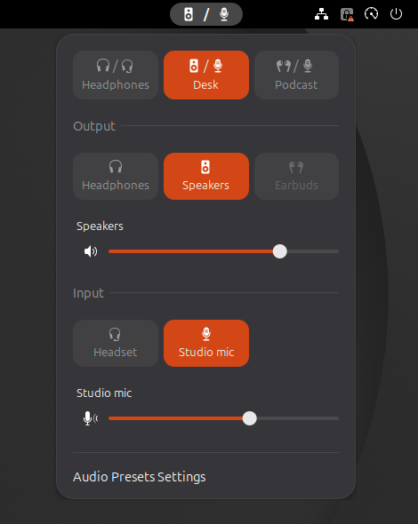

# Audio Presets

A GNOME Shell extension that switches your audio **output and input together with one click**.

<p align="center"></p>

## Features

- **Output + input presets.** One click sets both default devices: *Headphones*,
  *Speakers*, *Podcast* — whatever pairs you use.
- **Panel indicator.** Icons of the active output and input, separated by a slash.
  The input icon lights up while something records from the microphone.
  Scroll over the button to change the volume.
- **Menu.** Preset buttons with icons, device tiles for picking an output or input
  by hand, volume sliders for the active devices.
- **Bluetooth on demand.** If the preset's headphones are not connected, the extension
  connects them. If they do not show up within 15 seconds, the preset falls back to a
  backup output and you get a notification.
- **Your own names and icons, hide the noise** (HDMI, S/PDIF, webcam mics).
  Only the extension sees the names; PipeWire and WirePlumber are not touched.
- **Survives reconnects.** Devices are recognised by their system name and Bluetooth
  MAC, not by the numeric ids that change on every replug.
- **Replaces the built-in volume icons** in the top bar (can be turned off).
  The volume sliders in Quick Settings stay.
- **Preferences window** with a preset editor and a device list.
  English and Russian translations.

## Requirements

- GNOME Shell 50
- PipeWire (the Shell talks to it through its PulseAudio layer)
- BlueZ, for Bluetooth devices

## Install

From source:

```bash
git clone https://github.com/north-leshiy/gnome-audio-presets.git
cd gnome-audio-presets
./build.sh          # compiles the settings schema and translations
ln -s "$PWD/extension" ~/.local/share/gnome-shell/extensions/audio-presets@north-leshiy.github.io
```

On Wayland the Shell picks up a new extension only after you log out and back in. Then:

```bash
gnome-extensions enable audio-presets@north-leshiy.github.io
```

`./build.sh pack` builds a zip for `gnome-extensions install`.
Building needs `glib-compile-schemas` and either GNU gettext or Python Babel (`pybabel`).

## Configure

Open the preferences (`gnome-extensions prefs audio-presets@north-leshiy.github.io`
or *Audio Presets Settings* at the bottom of the menu):

- **Devices** — every device the extension has seen, plus paired Bluetooth audio
  devices: show or hide, rename, pick an icon.
- **Presets** — add, reorder and delete presets; pick an output, an input and an
  optional fallback output.

A scripted setup is in [`examples/setup-example.sh`](examples/setup-example.sh):
put your device names into the variables at the top and run it.

### Set it up with an AI agent

Paste this into Claude Code or another coding agent running on your machine:

```text
Configure the GNOME Shell extension "Audio Presets" (audio-presets@north-leshiy.github.io) for my computer.

1. List my audio devices: `pactl -f json list sinks` and `pactl -f json list sources`
   (skip *.monitor), plus paired Bluetooth audio devices (`bluetoothctl devices Paired`,
   then `bluetoothctl info <MAC>`).
2. Show me the list and ask which presets I want (name, output, input, optional fallback
   output), which devices to hide, and what to call them.
3. Build the JSON in the format of examples/setup-example.sh from the extension's repository
   (https://github.com/north-leshiy/gnome-audio-presets):
   - device keys: `output:<node.name>`, `input:<node.name>`, `output:bt:<MAC>`, `input:bt:<MAC>`;
   - icons: audio-headphones-symbolic, audio-headset-symbolic, earbuds-symbolic,
     audio-speaker-cabinet-symbolic, audio-speakers-symbolic, video-display-symbolic,
     audio-input-microphone-symbolic, audio-input-microphone-studio-symbolic, camera-web-symbolic.
4. Show me the JSON, and after I confirm write it with
   `gsettings --schemadir ~/.local/share/gnome-shell/extensions/audio-presets@north-leshiy.github.io/schemas
   set org.gnome.shell.extensions.audio-presets devices|presets '<json>'`.
   Do not change my current default audio devices.
```

Settings live in dconf under `/org/gnome/shell/extensions/audio-presets/`:

```bash
dconf dump /org/gnome/shell/extensions/audio-presets/ > audio-presets.ini   # backup
dconf load /org/gnome/shell/extensions/audio-presets/ < audio-presets.ini   # restore
```

## Notes

- Bluetooth headsets switch to the low-quality headset profile (HFP) when an app records
  from their microphone. A preset sets the input before the output, so with a separate
  microphone the headphones stay in high-quality A2DP.
- If quick-settings-audio-panel is installed, turn it off: both touch the built-in
  volume indicators.

## Translations

The extension uses gettext, as GNOME extensions normally do: strings in the code are
English, the menu and preferences follow the system language. To add a language:

```bash
./build.sh pot                                   # refresh extension/po/audio-presets.pot
cp extension/po/audio-presets.pot extension/po/<lang>.po   # translate it
./build.sh                                       # compile into extension/locale/
```

## Development

```bash
tests/run.sh                    # unit tests of the core (gjs, no Shell, no real audio)
tests/devkit.sh start --seed    # nested GNOME Shell in an isolated session
tests/devkit.sh eval 'Main.panel.statusArea["audio-presets@north-leshiy.github.io"].menu.open()'
tests/devkit.sh shot /tmp/shot.png
tests/devkit.sh stop
```

`tests/devkit.sh` needs `mutter-dev-bin`. It starts a separate D-Bus session, dconf
database and extensions directory, and refuses to continue if your real
`~/.config/dconf/user` would be touched. `tests/devkit-helper` turns on unsafe mode
(Eval and Screenshot over D-Bus) **inside the nested Shell only** — never install it
into a real session.

⚠️ PipeWire and BlueZ in the nested Shell are the real ones: applying a preset there
switches your actual audio and may connect your actual headphones.

The preferences window is tested without clicks: `tests/prefs.harness.js` loads
`prefs.js`, presses buttons through the widget tree and keeps settings in memory
(it needs the display of a running devkit):

```bash
GI_TYPELIB_PATH=/usr/lib/gnome-shell/girepository-1.0:/usr/lib/gnome-shell \
LD_LIBRARY_PATH=/usr/lib/gnome-shell GSETTINGS_BACKEND=memory LANGUAGE=en \
WAYLAND_DISPLAY=wayland-1 gjs -m tests/prefs.harness.js
```

Read-only probes against the live system:

```bash
gjs -m tests/bluez.probe.js
GI_TYPELIB_PATH=/usr/lib/gnome-shell LD_LIBRARY_PATH=/usr/lib/gnome-shell gjs -m tests/catalog.probe.js
```

Design notes and specs are in [`openspec/`](openspec/).

## License

GPL-2.0-or-later. The `earbuds` icon comes from Bootstrap Icons (MIT), see
[`extension/NOTICE`](extension/NOTICE).
